# Offline Reverb Analysis Report

**Input WAV:** `samples/verb_ir.wav`  
**Sample rate:** 48000 Hz (expected 48000 Hz)  
**Channels:** 2  
**Samples:** 1151844  
**Duration:** 23.996750 s

---

## Impulse response

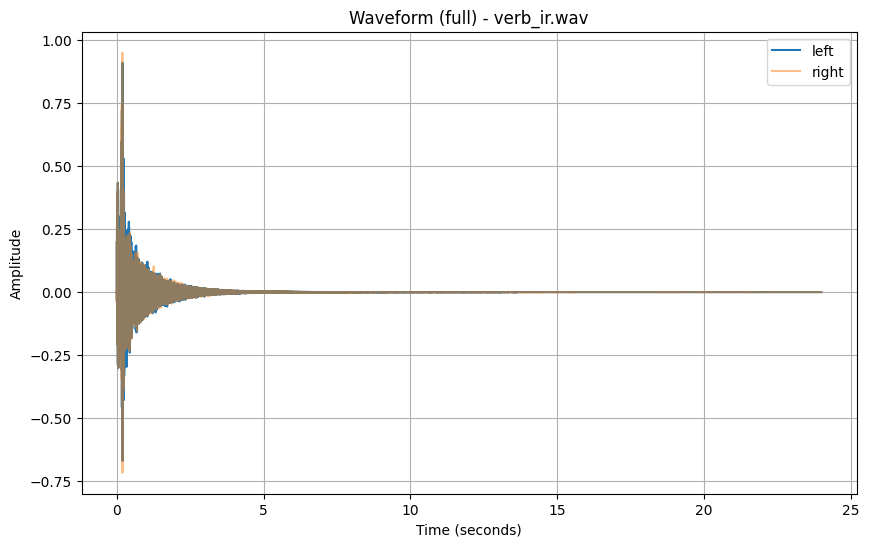

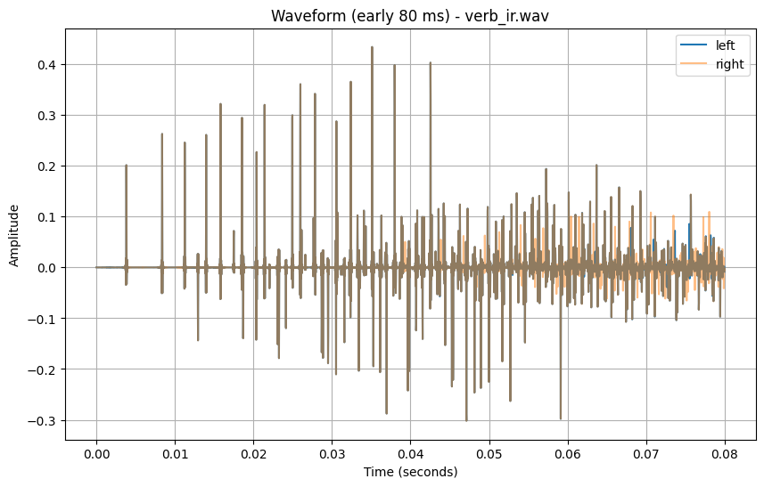

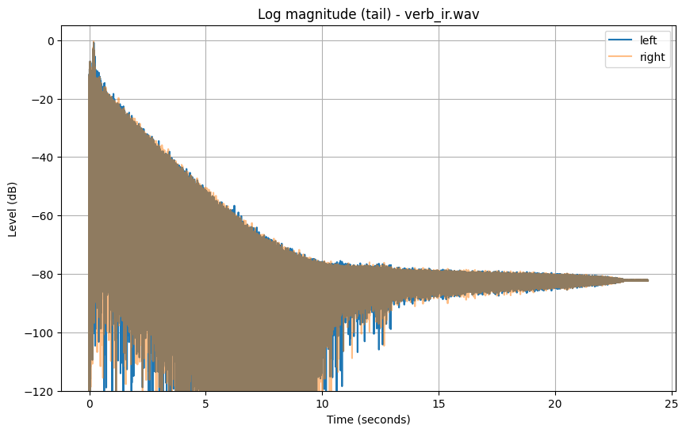


## Decay / EDC

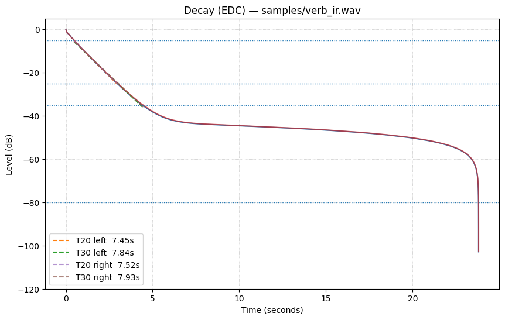

```text
[left] analysis_start_sample_index=9287
  early_0_to_-10_time=1.0557s
  EDT: NA
  T20: range=[-5.0,-25.0]dB time=[0.4713,2.9514]s slope=-8.058840dB/s r2=0.999619 rt60=7.4452s
  T30: range=[-5.0,-35.0]dB time=[0.4713,4.4115]s slope=-7.651142dB/s r2=0.998505 rt60=7.8420s

[right] analysis_start_sample_index=9025
  early_0_to_-10_time=1.0613s
  EDT: NA
  T20: range=[-5.0,-25.0]dB time=[0.4780,2.9747]s slope=-7.979435dB/s r2=0.999571 rt60=7.5193s
  T30: range=[-5.0,-35.0]dB time=[0.4780,4.4655]s slope=-7.568786dB/s r2=0.998477 rt60=7.9273s
```

## RT60 by band

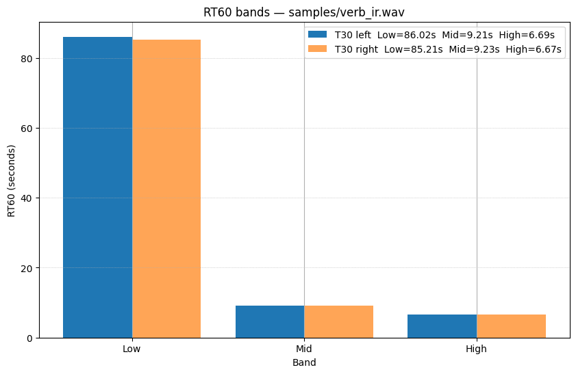

```text
[left]
Band  T30_RT60(s)
Low  86.019
Mid  9.213
High  6.688

[right]
Band  T30_RT60(s)
Low  85.214
Mid  9.226
High  6.666
```

## Frequency response

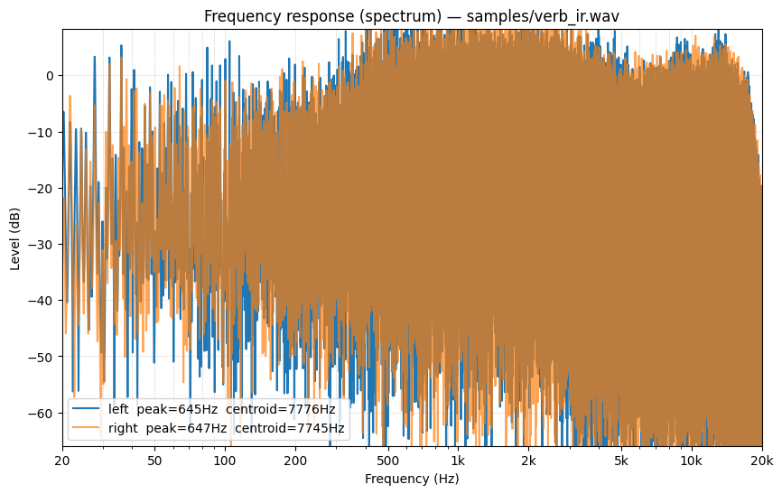

```text
[left] start_sample=9287  len_samples=1142557  peak=645.5Hz  centroid=7775.9Hz
[right] start_sample=9025  len_samples=1142819  peak=647.0Hz  centroid=7744.8Hz
```

## Spectrogram

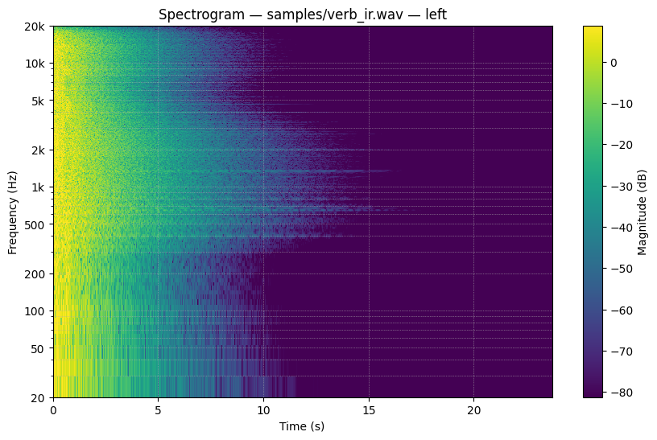

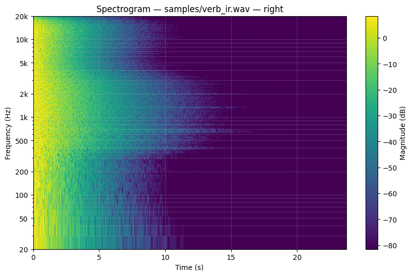

```text
[left] start_sample=9287  len_samples=1142557  dur=23.803s  stft(n_fft=4096, frames=2224)
[right] start_sample=9025  len_samples=1142819  dur=23.809s  stft(n_fft=4096, frames=2225)
```

## Waterfall

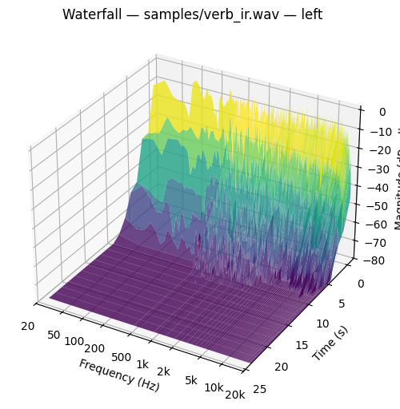

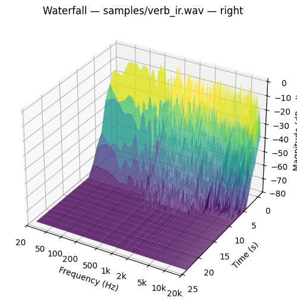

```text
[left] start_sample=9287  dur=23.803s  slices=18  f_bins=1705
[right] start_sample=9025  dur=23.809s  slices=18  f_bins=1705
```

## Diffusion / echo density proxy

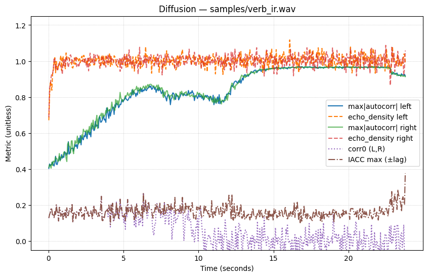

```text
[left]
  median_max_abs_autocorr=0.854
  median_echo_density=1.002
  median_corr0=0.053
  median_iacc_max=0.158
[right]
  median_max_abs_autocorr=0.862
  median_echo_density=1.003
  median_corr0=0.053
  median_iacc_max=0.158
```

## Modal cloud

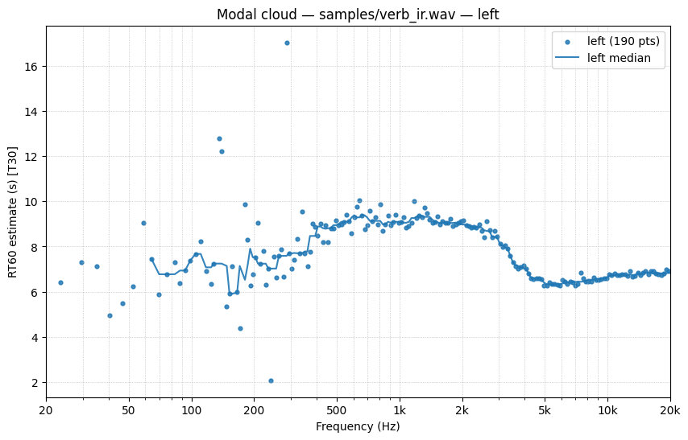

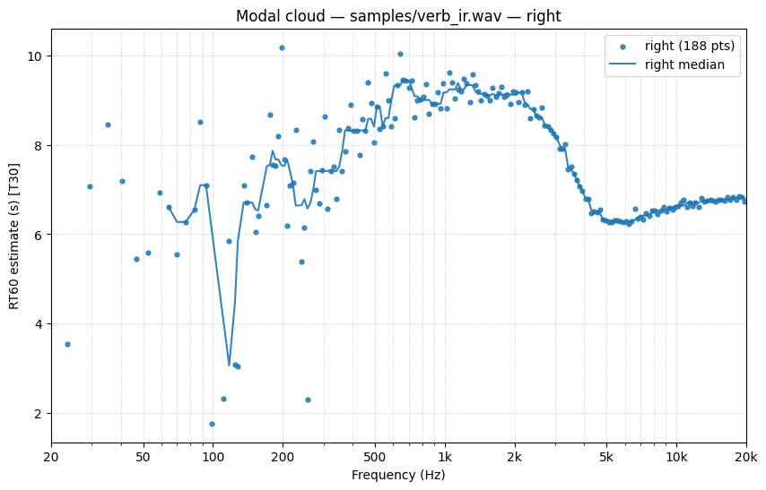

```text
[left] metric=t30 start_sample=9287 dur=23.803s points=190
  rt60: median=7.573s  p90=9.309s  max=17.050s
[right] metric=t30 start_sample=9025 dur=23.809s points=188
  rt60: median=7.421s  p90=9.247s  max=10.182s
```
